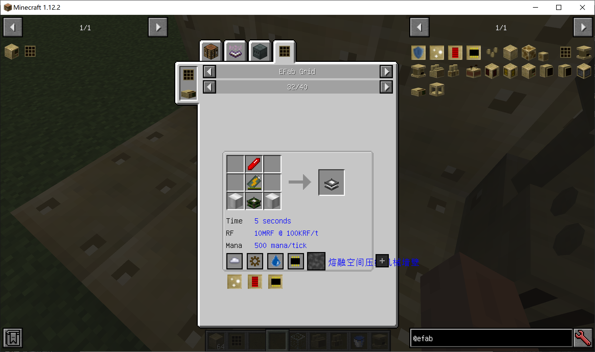

合成时有时候配方下会有一些额外的东西，如图为例

灰色的框代表需要的元件，云为蒸汽，齿轮为齿轮箱，水滴为储罐，芯片为处理器。
蒸汽需要锅炉产生，摆放必须类似下图，锅炉引擎需要放在锅炉上，锅炉下必须有热源，锅炉旁需要有储罐

齿轮箱，储罐和处理器摆放到结构里即可，储罐里放合成需要液体
下方黄框内为升级
放在合成终端的相应位置即可

合成配方下的time代表合成时间。
rf代表需要多少能量，rf的输入需要用rf存储器，将其摆在结构里并通入能量即可。
mana代表需要的魔力，魔力输入需要魔力容器，将其摆在结构里并将魔力发射器对准其发射即可。
请注意，若一直反复显示mana不足的话需要等魔力缓存一会或放置多个魔力发射器提高每t魔力输入量
